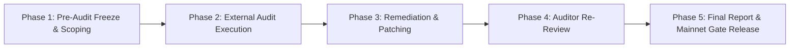

# Refract Protocol Pre-Mainnet Security Audit Tracking & Remediation Package

**Document Version:** 1.0.0  
**Scope:** Core Smart Contracts (`RefractPool`, `RefractPolicyRegistry`, `RefractOracle`)  
**Target Environment:** Soroban SDK v21.0.0 / Stellar Network  
**Author:** OrderStream (`healthdecoded77@gmail.com`)  
**Status:** Scoping Complete — Ready for External Engagement Commissioning

---

## 1. Audit Scoping Package

This document forms the official scoping specification and engagement tracking board for the independent third-party security audit required prior to Refract Protocol's mainnet deployment.

### 1.1 In-Scope Target Contracts
The audit scope encompasses the three core contracts that hold capital, manage coverage obligations, or supply parametric trigger data:

| Contract Crate | Path | Primary Responsibilities | Target Lines |
| :--- | :--- | :--- | :--- |
| **`refract-pool`** | `pool/src/lib.rs` | Capital custody, share accounting, policy underwriting, premium calculations, and automated claims settlement. | ~1,050 lines |
| **`refract-policy`** | `policy/src/lib.rs` | Global policy indexation, holder registry, and policy status tracking. | ~390 lines |
| **`refract-oracle`** | `oracle/src/lib.rs` | Parametric event feeds, relayer authorization, threshold evaluations, and staleness validation. | ~310 lines |

### 1.2 Out-of-Scope Boundaries
- Off-chain frontend web applications and indexers.
- External token implementations (standard Stellar Asset Contract / USDC wrapper is assumed secure).
- Proposed or unmerged governance/DAO contracts (deferred to Phase 2 audit post-landing).

### 1.3 Key Protocol Invariants (For Auditor Verification)
1. **Solvency Invariant**: At all ledger timestamps, total pooled capital must satisfy:
   $$\text{TotalCapital} \ge \text{TotalCoverage} \times \frac{\text{BPS}}{\text{max\_utilization\_bps}}$$
2. **Payout Determinism**: Payouts from `process_claim` can **only** be credited to the original `policy.holder` recorded at creation time; zero funds may be redirected by third-party callers.
3. **No Phantom Dilution**: Liquidity provider shares can never be minted without corresponding USDC capital deposits (`amount * total_shares / total_capital`).
4. **Oracle Staleness Rejection**: Readings older than 1,800 seconds (30 minutes) or dated with future timestamps must be rejected unconditionally.

---

## 2. Auditor Deliverable Packet & Cross-References

Auditors should review the following accompanying documentation prepared during the pre-audit hardening phase:
- **`GRIEFING_ANALYSIS.md`**: Formal analysis of permissionless entrypoints (`process_claim`, `expire_policy`) and Soroban resource fee attribution.
- **`INCIDENT_RESPONSE.md`**: Post-incident pause-and-migrate runbook and multi-contract atomic emergency lockdown procedures.
- **`clippy.toml` & Static Gate**: Strict Soroban linting rules rejecting runtime panics (`unwrap`, `expect`) in favor of typed `Result<T, E>`.

---

## 3. Commissioning Plan & Audit Lifecycle

### 3.1 Auditor Selection Criteria
The protocol targets firms with demonstrated expertise in Rust, WebAssembly, and the Soroban / Stellar execution environment (e.g., Trail of Bits, OtterSec, OpenZeppelin, CertiK, Kudelski Security).

### 3.2 Timeline & Milestones
- **T0 — Scope Delivery**: Scoping package delivered with frozen commit hash.
- **T0 + 3 Weeks — Draft Report**: Delivery of initial audit findings and severity ratings.
- **T0 + 4 Weeks — Remediation Period**: Core team ships patch PRs referencing Finding IDs.
- **T0 + 5 Weeks — Re-Review Sign-off**: Auditor verifies fixes against original findings.
- **T0 + 6 Weeks — Mainnet Gate Cleared**: Final audit report published to repository.

---

## 4. Remediation Status Board & Findings Tracker

### 4.1 Internal Pre-Audit Hardening Log (Wave 9)
The following pre-audit vulnerabilities and security improvements have been proactively remediated and merged:

| Finding / Issue ID | Component | Severity | Description | Status | Remediating PR |
| :--- | :--- | :--- | :--- | :--- | :--- |
| **REF-SEC-01** (#138) | `pool` | **High** | Precision loss compounding across `_calc_premium` divisions. | **Fixed** | PR #175 |
| **REF-SEC-02** (#139) | CI / SDK | **Medium** | Static-analysis gate for Soroban-specific footguns & panics. | **Fixed** | PR #176 |
| **REF-SEC-03** (#136) | `pool` | **Medium** | Griefing-cost analysis for permissionless entrypoints. | **Fixed** | PR #177 |
| **REF-SEC-04** (#137) | Protocol | **High** | Multi-contract post-incident recovery & runbook contract. | **Fixed** | PR #178 |
| **REF-SEC-05** (#54) | `pool` | **Low** | Storage access optimization via `PoolState` cached snapshots. | **Fixed** | PR #174 |
| **REF-SEC-06** (#55) | Workspace | **Low** | Wasm binary size budget & optimization enforcement. | **Fixed** | PR #173 |

### 4.2 External Audit Findings Board (Template for Engagement)
*This board will be updated live as findings are delivered by the external audit firm.*

| ID | Contract | Title / Summary | Severity | Status | Fix PR | Auditor Sign-off |
| :--- | :--- | :--- | :--- | :--- | :--- | :--- |
| *EXT-01* | *pool* | *[Draft Finding Title]* | *High* | *Pending Audit* | — | *Pending* |
| *EXT-02* | *policy* | *[Draft Finding Title]* | *Medium* | *Pending Audit* | — | *Pending* |
| *EXT-03* | *oracle* | *[Draft Finding Title]* | *Low* | *Pending Audit* | — | *Pending* |

*Status definitions: `Open` | `In-Progress` | `Fixed` | `Acknowledged-Risk` | `Disputed`*

---

## 5. Re-Review & Sign-Off Verification Checklist

Before any external audit finding is marked as `Resolved` in `SECURITY.md` and this tracking board, it must satisfy the following strict acceptance criteria:

1. **Critical & High Severity Findings**:
   - [ ] Root cause identified and documented in PR description.
   - [ ] Fix implemented with defensive regression unit tests and property tests.
   - [ ] Dedicated patch commit submitted to external auditor.
   - [ ] Written auditor confirmation received verifying the vulnerability is completely mitigated without side effects.
2. **Medium & Low Severity Findings**:
   - [ ] Remediation PR reviewed and approved by two core maintainers.
   - [ ] Comprehensive unit test coverage added in contract test harness.
   - [ ] Green CI build across all lint, footgun, and build gates.
3. **Acknowledged Risks / Won't Fix**:
   - [ ] Formal architectural justification documented in `AUDIT_TRACKING.md`.
   - [ ] Explicit sign-off from protocol technical leads and community disclosure.
