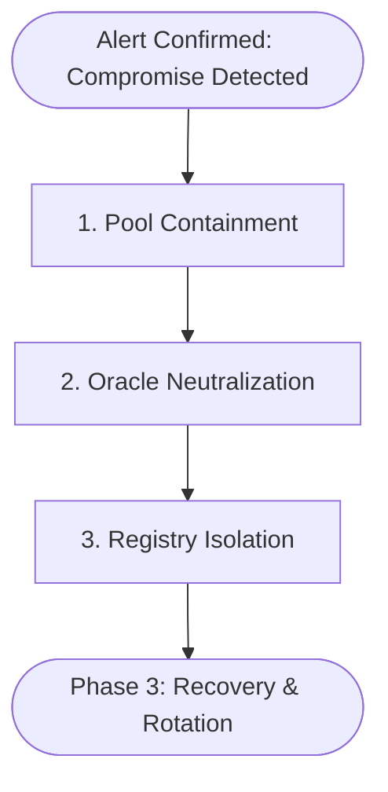

# Refract Protocol Incident Response Runbook: Admin Key Compromise

**Document Version:** 1.0.0  
**Scope:** `RefractPool`, `RefractPolicyRegistry`, `RefractOracle`, `RefractIncidentResponse`  
**Classification:** Operational Security Runbook (Post-Incident Recovery)  
**Author:** OrderStream (`healthdecoded77@gmail.com`)  
**Target Platform:** Stellar Network / Soroban Smart Contracts

---

## 1. Executive Summary & Threat Model

This runbook defines the formal operational procedures for detecting, containing, and recovering from an emergency where the protocol's administrative private key is leaked, exfiltrated, or actively exploited by a malicious adversary.

### Primary Threat Vectors:
1. **Adversarial Reconfiguration**: Exploitation of `set_pool_config` on `RefractPool` to drop rates to 0, artificially manipulate utilization limits, or invalidate underwriting capacity.
2. **Oracle Manipulation**: Adding malicious relayers (`add_relayer`) on `RefractOracle` to forge synthetic depeg or market crash events and initiate illegitimate policy payouts.
3. **Registry Hijacking**: Disconnecting the authoritative registry via `set_policy_registry` or pointing `set_pool_contract` to a malicious drain contract.
4. **Administrative Hostile Takeover**: Rotating `set_admin` to an adversary-controlled key to permanently lock out legitimate maintainers.

---

## 2. Phase 1: Detection & Signal Identification

Immediate detection of on-chain anomalies is critical to executing the containment playbook before adversary transactions are processed by network validators.

### 2.1 On-Chain Monitoring Signatures
The security monitoring system must listen for the following specific ledger events:

| Contract | Event Symbol | Payload / Topics | Alert Severity | Description |
| :--- | :--- | :--- | :--- | :--- |
| **`RefractPool`** | `ADMIN_SET` | `(symbol_short!("ADMIN_SET"),), (new_admin,)` | **CRITICAL** | An administrative rotation was triggered. If unscheduled, indicates immediate key compromise. |
| **`RefractPool`** | `CFG_SET` | `(symbol_short!("CFG_SET"),), ()` | **HIGH** | Operational pool parameters were altered. Verify against approved governance proposal hashes. |
| **`RefractPool`** | `REG_SET` | `(symbol_short!("REG_SET"), caller), (registry,)` | **CRITICAL** | Active policy registry pointer was redirected. |
| **`RefractOracle`** | `admin_set` | `(Symbol("admin_set"),), (new_admin,)` | **CRITICAL** | Oracle administrator transferred. |
| **`RefractOracle`** | `relayer_added` | `(Symbol("relayer_added"),), (relayer,)` | **HIGH** | New relayer authorized to submit parametric trigger feeds. |
| **`RefractPolicyRegistry`**| `admin_set` | `(Symbol("admin_set"),), (new_admin,)` | **CRITICAL** | Registry administrator transferred. |
| **`RefractPolicyRegistry`**| `pool_contract_set`| `(Symbol("pool_contract_set"),), (pool,)` | **CRITICAL** | Registry trusted pool origin redirected. |

---

## 3. Phase 2: Containment & Operational Sequencing

When compromise is verified, responders must execute containment in strict sequence to prevent value extraction.

### Optimal Multi-Contract Containment Order


1. **Step 1: Pool Containment (`RefractPool`)**:
   - *Objective*: Prevent capital outflow and halt new risk exposure.
   - *Action*: Invoke emergency pause or defensively clamp `PoolConfig` (setting `max_coverage = 0` and `max_utilization_bps = 0`).
2. **Step 2: Oracle Neutralization (`RefractOracle`)**:
   - *Objective*: Prevent fraudulent parametric trigger injection.
   - *Action*: Revoke unverified relayers (`remove_relayer`) to halt price/feed updates.
3. **Step 3: Registry Isolation (`RefractPolicyRegistry`)**:
   - *Objective*: Prevent rogue contract bindings.
   - *Action*: Freeze registry state or verify active pool pointer.

---

## 4. Phase 3: Recovery — Atomic Lockdown vs. Multi-Tx Race

### The Critical Dilemma: The Multi-Transaction Window
In standard manual operations, an incident response team attempting to recover 3 contracts submits 3 separate transactions:
$$\text{Tx}_1: \text{Pool.set\_admin} \longrightarrow \text{Tx}_2: \text{Registry.set\_admin} \longrightarrow \text{Tx}_3: \text{Oracle.set\_admin}$$
Under adversarial time pressure, if the attacker detects the response:
- The attacker can observe $\text{Tx}_1$ in the transaction submission queue or ledger close.
- The attacker races to front-run $\text{Tx}_2$ or $\text{Tx}_3$, rotating the remaining contract admin to their own key or injecting a malicious relayer into `RefractOracle`.

### The Solution: Dedicated Atomic Coordinator (`RefractIncidentResponse`)
To completely eliminate this race condition, `RefractIncidentResponse` bundles cross-contract recovery into **a single atomic transaction**:

```rust
// incident_response/src/lib.rs
coordinator.emergency_lockdown(
    &admin_or_guardian,
    &pool_address,
    &registry_address,
    &oracle_address,
    &new_cold_multisig,
);
```
- **Atomicity Guarantee**: Stellar/Soroban guarantees that either all 3 contract administrators are rotated to the secure hardware/multisig key in the same ledger transaction, or the entire transaction reverts.
- **Zero Race Window**: The adversary cannot wedge transactions between the rotations.

---

## 5. Tabletop Incident Simulation & Findings

A formal simulation of this tabletop runbook was implemented and verified in `incident_response/src/test.rs`:

### Simulation Scenario
1. **Setup**: Protocol deployed with `admin` holding administrative rights across `RefractPool`, `RefractPolicyRegistry`, and `RefractOracle`. A separate `guardian` key is registered in `RefractIncidentResponse`.
2. **Adversary Action**: An adversary obtains knowledge of the compromised `admin` key.
3. **Response Action**: The incident response team triggers `emergency_lockdown(&admin, pool, registry, oracle, &new_safe_admin)`.
4. **Adversarial Attempt**:
   - Adversary immediately attempts to call `pool.set_pool_config(&admin, ...)` $\rightarrow$ **Reverts with `Err(PoolError::Unauthorized)`**.
   - Adversary attempts `pool.set_admin(&admin, &adversary)` $\rightarrow$ **Reverts with `Err(PoolError::Unauthorized)`**.
   - Adversary attempts `registry.set_admin(&admin, &adversary)` $\rightarrow$ **Reverts with `Err(RegistryError::Unauthorized)`**.
   - Adversary attempts `oracle.set_admin(&adversary)` $\rightarrow$ **Fails; oracle admin is already transferred to `new_safe_admin`**.
5. **State After Recovery**:
   - `new_safe_admin` possesses exclusive operational control over Pool, Registry, and Oracle.
   - Compromised key is completely powerless.

### Lessons Learned & Gaps Identified:
- **Pre-authorization Requirement**: Cross-contract invocations require that either the caller is the current admin or contracts support a registered Guardian role. Protocols must deploy the incident response coordinator at genesis so its address is pre-wired into recovery keys.
- **Off-chain Key Hygiene**: Emergency guardian keys must be kept on segregated cold storage (air-gapped hardware or multi-party computation multisig) to ensure the guardian key cannot be compromised simultaneously with the operational admin key.
